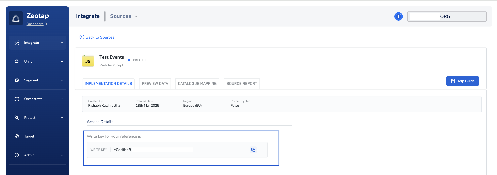

# Understanding Your Write Key

The **Write Key** is a unique identifier essential for integrating the Zeotap Web SDK with your website or application. It ensures that all data collected by the SDK is correctly attributed to your source in your Zeotap account.

## How to Obtain Your Write Key

You can find your Write Key within the Zeotap Customer Data Platform (CDP) after setting up a "Web Javascript Source."

**Here's a step-by-step guide:**

1.  **Access Zeotap CDP:**
    *   Log in to your Zeotap Customer Data Platform account. If you don't have access, please contact your Zeotap account manager or support team.

2.  **Create or Locate Your Web Javascript Source:**
    *   **If you haven't already, create a new "Web Javascript Source"** within the CDP. This source represents your website or web application where you'll be implementing the SDK. For detailed instructions, refer to the [official Zeotap documentation on creating a Web JS source](https://docs.zeotap.com/articles/#!integrate-customer/creating-web-js-source).
    *   **If you have an existing source,** navigate to integrate > sources section where all sources are listed.

3.  **View Source Details & Find the Write Key:**
    *   Once you've selected or created your Web Javascript Source, go to its "Implementation Details" section.
    *   The **Write Key** will be displayed here. It's a long string of alphanumeric characters.

    
    *(The image above shows an example of the Zeotap CDP interface where the Write Key can be found.)*

## Using the Write Key in Your SDK Initialization

When you initialize the Zeotap Web SDK in your website's code, the Write Key is the first and most crucial parameter you provide:

```javascript
window.zeotap.init("YOUR_WRITE_KEY", {
  // ... other configuration options
});
```