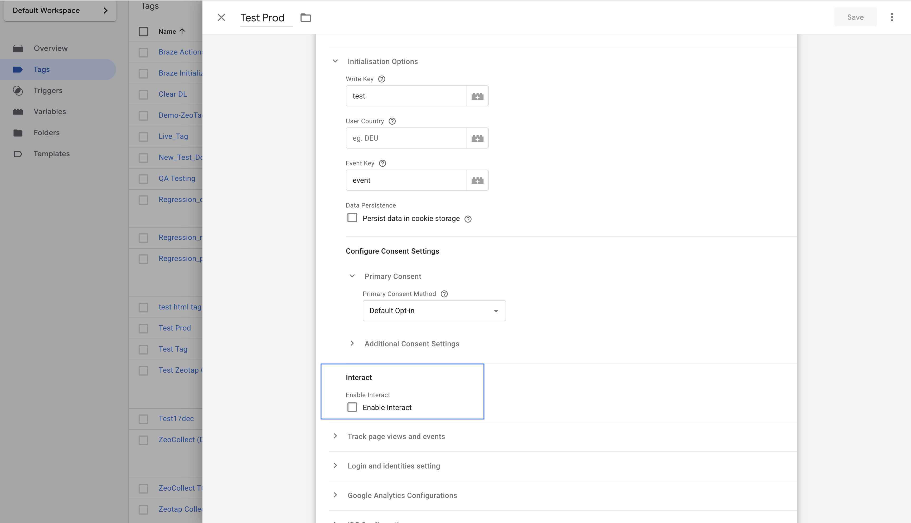

# 1. Initialization Options

This is the first and most crucial step in configuring your Zeotap Collect Tag in Google Tag Manager. These settings define how the tag authenticates, handles data storage regions, identifies events, manages user identifiers across domains, and processes user consent.

Carefully configure the following fields:

## Basic Configuration


### Write Key

*   **Purpose**: Uniquely identifies your GTM-based source in your Zeotap CDP account.
*   **Details**: This key is **mandatory** for recording any events. You will find this write key in the source details section of your Zeotap CDP account after creating a GTM-based source.
*   **Action**: Enter the provided Write Key.

### User Country

*   **Purpose**: Specifies the ISO Alpha 3 country code (e.g., "USA", "DEU") to determine the geographical region for data storage.
*   **Details**: If this field is left blank, Zeotap servers will attempt to determine the region based on the user's IP address. It is recommended to use this field if your Zeotap account is configured for specific data storage regions to ensure compliance and proper data handling.
*   **Action**: Enter the ISO Alpha 3 country code if applicable.

### Event Key

*   **Purpose**: Defines the key in the `dataLayer` object that holds the event name.
*   **Details**: If you are using Google Tag Manager's default event key, which is `event`, you can leave this field empty. If your setup uses a different key to pass event names in the dataLayer (e.g., `custom_event_name`), specify that key here.
*   **Action**: Enter your custom dataLayer event key if not using the GTM default (`event`).

### Data Persistence

*   **Purpose**: Manages user identification across multiple domains or subdomains owned by your organization.
*   **Details**: When users navigate between different domains (e.g., `brand.com` to `shop.brand.com` or `anotherbrand.com`), user identifiers might be reset by default. To prevent this and maintain a consistent user view, enable this option.
*   **Action**: Check the **Persist data in cookie storage** checkbox if you operate a multi-domain website and need to track users seamlessly across these domains. This will store identifiers in cookie storage, making them accessible irrespective of the current domain.

## Consent Method

This setting determines how the Zeotap Collect SDK handles user consent for data collection. It is crucial for compliance with privacy regulations like GDPR.

*   **Note**: Regardless of the chosen method, you have the option to send Brand Consent. "Additional Consent Settings" can be used to send TC strings and custom brand consent information.

Choose one of the following options:

### a) Default Opt-in


*   **Behavior**: Sets the `optOut` flag in the SDK to `false` by default, meaning events are recorded unless an explicit opt-out is signaled.
*   **Use Case**: Select this if you manage consent through other mechanisms (e.g., server-side, API integration, file upload) and only want the GTM tag to fire for users who have already consented. The communication of consent status happens outside this GTM tag's direct logic.
*   **Configuration**: You can use "Additional Consent Settings" to pass TC String and custom brand consent details if needed.

### b) Check TCF CMP (IAB Transparency and Consent Framework)


*   **Behavior**: Sets `useConsent` and `checkForCMP` options in the SDK to `true`. The SDK will automatically look for a TCF-compliant Consent Management Platform (CMP) on your website. It does this by checking for the `cmp.js` script and the `__cmp` variable in the global scope. It then queries the TCF API to fetch the latest publisher consent status before recording any events on each SDK load.
*   **Use Case**: Select this if you use an IAB TCF v2.0 or v2.2 compliant CMP on your website.
*   **Configuration**:
    *   **Purposes for tracking of events**: You **must** configure this parameter when using the GDPR consent module. This field requires you to specify a list of TCF Purpose IDs (e.g., `1,2,3`) for which consent must be granted by the user for the SDK to track events. The SDK will check if the user has consented to *all* specified purposes.
    *   You can also use "Additional Consent Settings" to send custom brand consent alongside TCF signals.

### c) Custom Consent


*   **Behavior**: Allows you to define a custom consent management logic based on signals from your `dataLayer`.
*   **Use Case**: Select this if you have a non-TCF CMP or a custom consent setup and want to control SDK behavior (tracking, cookie syncing) based on specific dataLayer events and variables.
*   **Configuration**: When you select "Custom Consent," you need to specify the following in the "SDK Consent Signals" section:
    *   **Event name**: Choose the dataLayer event that is pushed when your custom consent status is determined or updated (e.g., `custom_consent_ready`, `consent_update`).
    *   **Other Variables**: Map dataLayer variables to control the SDK's consent-related functionalities:
        *   `Track` signal: A dataLayer variable whose value (e.g., `true`/`false`) determines if event tracking is allowed.
        *   `Cookie Sync` signal: A dataLayer variable for managing cookie synchronization.
        *   `Identify` signal: Deprecated not required.
*   **Note**: As with other methods, "Additional Consent Settings" can be used to send TC string and custom brand consent if needed.

### Additional Consent Options

These settings provide supplementary ways to send consent information to Zeotap, often used in conjunction with or as an enhancement to the primary "Consent Method" selected above.


#### 1. Include TC String in the requests

*   **Purpose**: Enables the Zeotap Collect Tag to read and forward the IAB TCF (Transparency and Consent Framework) TC string from your Consent Management Platform (CMP) with its data collection requests.
*   **Prerequisite**: A TCF API (compliant with TCF v2.0 or v2.2) must be available on the page for the SDK to successfully read the TC string.
*   **Behavior & Configuration**:
    *   Simply check this box if you have a TCF-compliant CMP and want the TC string to be included.
    *   **Important Note**: If your primary "Consent Method" (selected above) is set to **Custom Consent** or **Default Opt-in**, and you still want to leverage TCF consent specifically for Zeotap's cookie sync features, you must select this "Include TC String in the requests" checkbox. This ensures that even if primary tracking consent is handled differently, the TCF consent stored by Zeotap can be utilized for cookie synchronization purposes.

#### 2. Include brand consent in the requests

*   **Purpose**: Allows you to send custom consent signals specific to your brand, independent of or in addition to TCF signals. This can be used with any of the primary "Consent Method" options.
*   **Use Case**: Useful for capturing granular consent choices that are not covered by the standard TCF purposes or for proprietary consent frameworks.
*   **Configuration**:
    *   When you check "Include brand consent in the requests," you will typically need to configure the following:
        *   **Brand Consents Event name**:
            *   Specify the `dataLayer` event name that is pushed when your custom brand consent information is set or updated on the page. For example, `brand_consent_updated` or `custom_preferences_set`.
        *   **Brand Consent Key-Value Pairs**:
            *   Define the specific brand consent signals as key-value pairs. These are typically read from `dataLayer` variables.
            *   **Key**: The name of the consent parameter (e.g., `newsletter_optin`, `product_recommendations`).
            *   **Value**: The `dataLayer` variable that holds the user's consent status for that key (e.g., `{{dlv_newsletter_consent}}`, `{{dlv_product_recs_consent}}` which might resolve to `true`/`false`, `granted`/`denied`, etc.).

By configuring these additional options, you can achieve a more nuanced and comprehensive approach to managing and communicating user consent through the Zeotap GTM Tag.

## Interact SDK


* **Purpose**: Enables loading of the Interact SDK for client-side profile data delivery.
* **Details**: When enabled, the Interact SDK is automatically loaded and initialized using the same source mapping and Write Key configured for the Web SDK.
* **Action**: Select this option to activate the Interact SDK via the GTM template.

### Retrieving Data on the Client Side Based on Configured “Data to send” for an Interaction

You can access the Interact SDK output in one of three ways:

#### 1. Local Storage

Stores the selected data in local storage under the Zeotap key `zeoParamsStoreLocal`, which the consuming platform can access on the client side. Below is the example of how to access localStorage using a custom code template in gtm.

```js
if (typeof Storage !== "undefined") {
  var targetingParamStr = localStorage.getItem("zeoParamsStoreLocal");
  if (targetingParamStr) {
    var targetingParameters = JSON.parse(targetingParamStr);
    // Use targetingParameters here
  }
}
```

#### 2. Session Storage

Stores the selected data in session storage under the Zeotap key `zeoParamsStoreSession`, which can be accessed by the consuming platform. Similar to local storage, you can push data to session storage and retrieve it as shown below.


```js
if (typeof Storage !== "undefined") {
  var targetingParamStr = sessionStorage.getItem("zeoParamsStoreSession");
  if (targetingParamStr) {
    var targetingParameters = JSON.parse(targetingParamStr);
    // Use targetingParameters here
  }
}
```