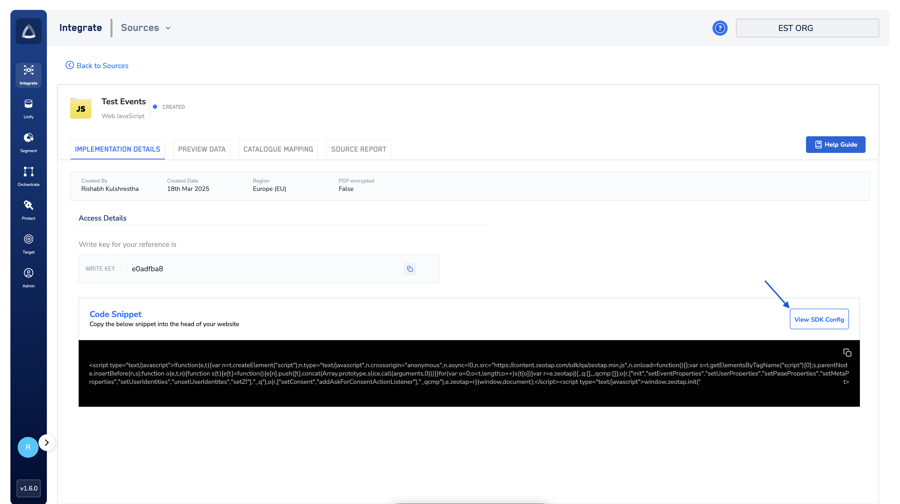
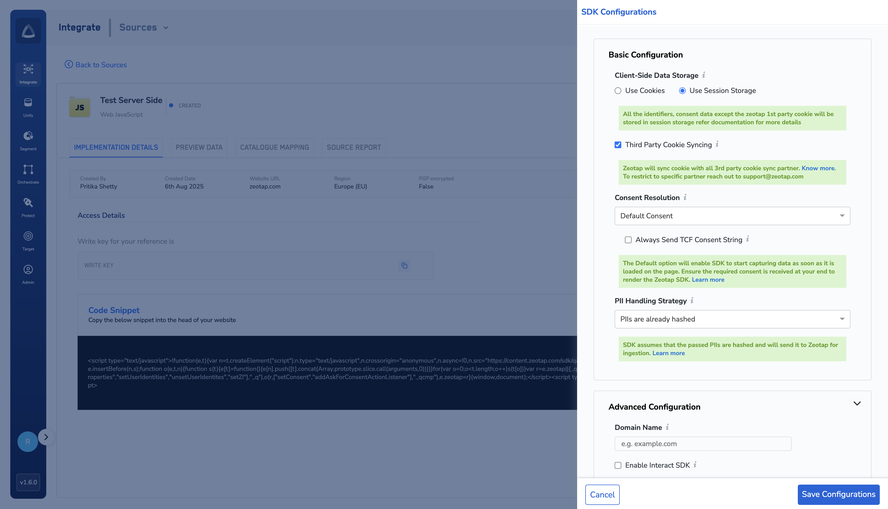
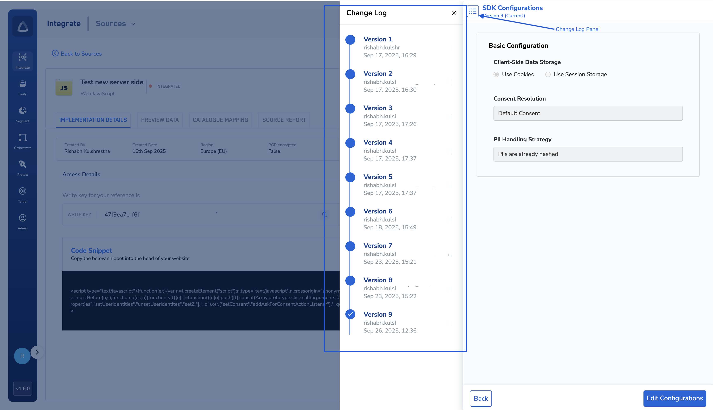

## Introduction
The Config Panel is where you define and manage all SDK settings for your project. Once saved, these settings are automatically applied to your SDK instances without requiring code changes or redeploys.

The SDK determines which config to use in the following order of priority:

1. **Server-side config** – Configs saved in the dashboard.
2. **Local fallback** – Stored in local storage if the SDK fails to fetch server-side config.
3. **Client-side config** – Hardcoded options in `init()` (used only if server-side and local fallback are unavailable).
4. **SDK defaults** – Built-in default values as a last resort.

---

## Steps to Configure

### 1. Log in to Zeotap CDP
- Login to your account on [Zeotap CDP](https://app.zeotap.com/)
- Go to your Web JS source. [How to create a source?](https://docs.zeotap.com/articles/#!integrate-customer/creating-web-js-source)

### 2. Open the Config Panel
- Click on the  **View SDK Config** button.
    
- You will see categories such as:
  - **Basic Configuration** (Consent Resolution, PII hashin mechanism, Usage of Cookie storage, etc)
  - **Advanced Configuration** (Enable ID5, domain name, etc)
  

### 3. Select Your Configurations
- Toggle on/off or choose from dropdowns depending on the option.
- Example:
  - Select TCF consent resolution mode.
  - Turn off cookie syncing.

### 4. Save Changes
- Click **Save** to store the configuration.
- Your settings are now tied to the API key.

### 5. Verify the Update
- Run your website with the SDK initialized.
- Configs are applied automatically following the **priority order**: server → local storage fallback → client-side(optional) → SDK defaults.

```js
window.zeotap.init("YOUR_KEY");
// SDK applies configs based on priority order automatically
```

---

### Tracking Changes

The Config Panel includes a Change Log that records every update made to your configurations.
This Change log panel:
- Shows who made the change and when.
- Useful for debugging configurations.
- Helps teams maintain an audit trail of SDK settings.




---

## Notes
- **Propagation Time**: Configs apply immediately but may take a few seconds depending on caching.
- **Mandatory Fields**: Some fields (e.g., Consent Resolution Mechanism, Identity Hashing, etc) are required for the SDK to work correctly.
The UI pre-populates defaults, so you don’t need to manually select them unless you want to change from the default.

---
